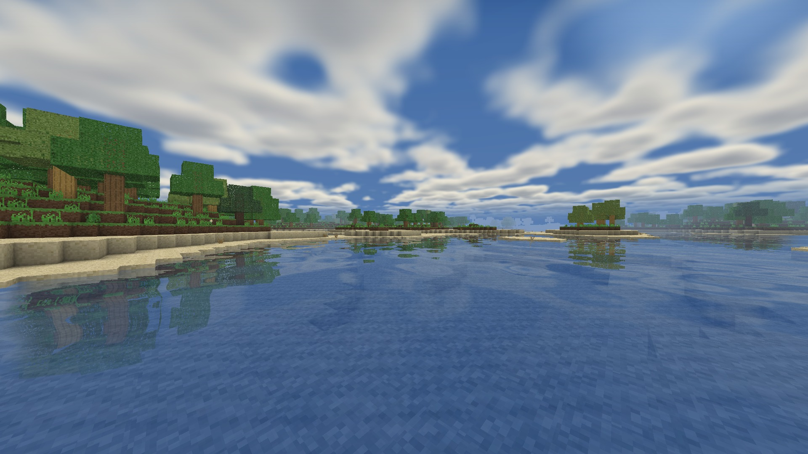
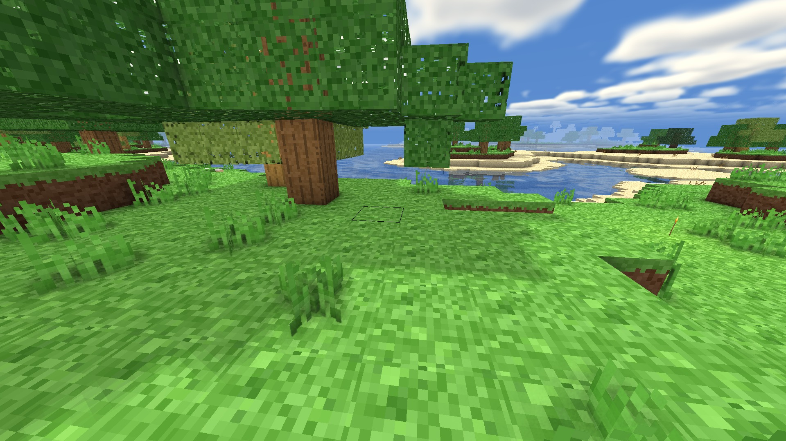
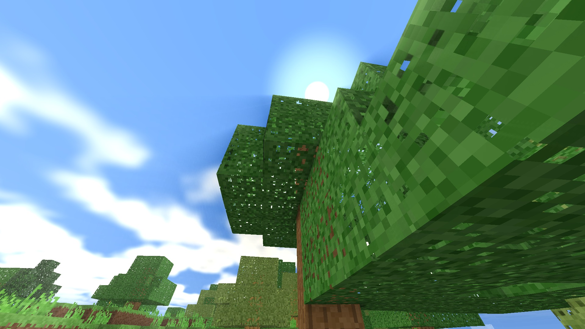
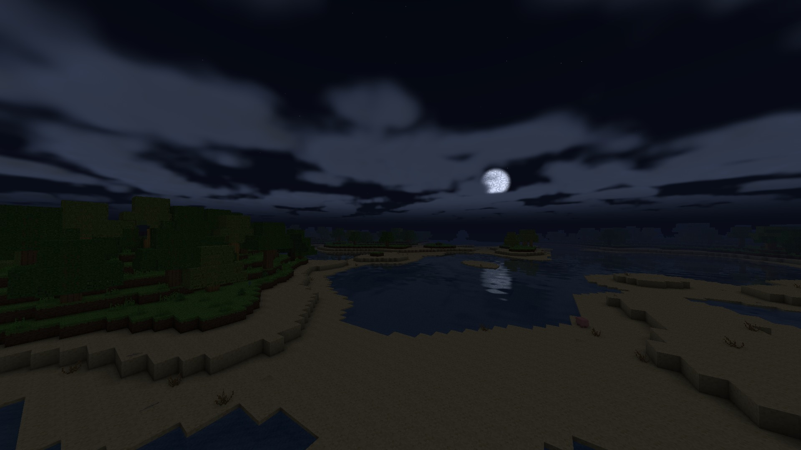
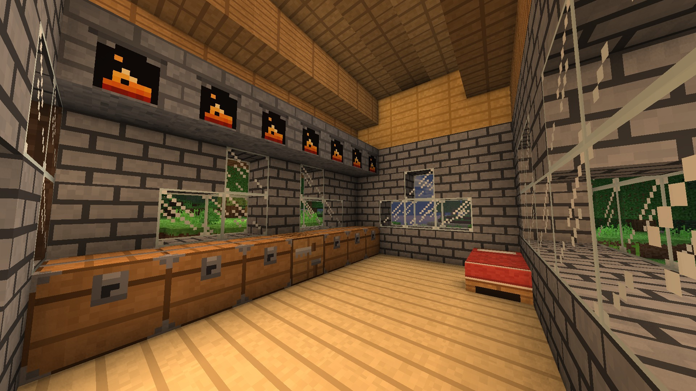
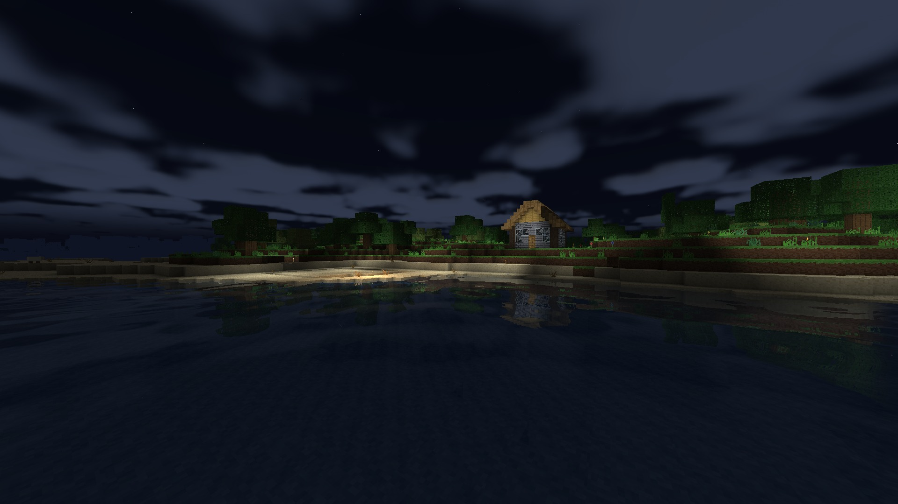
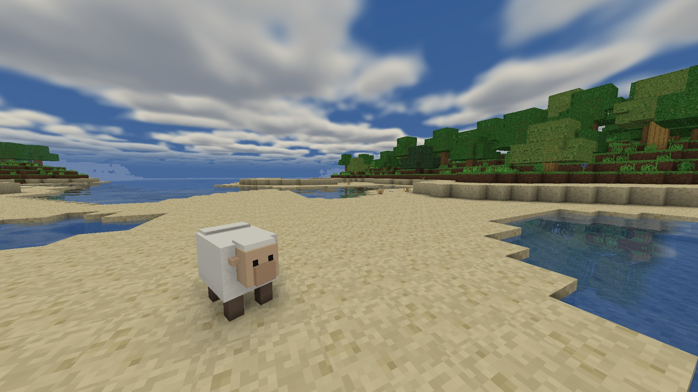
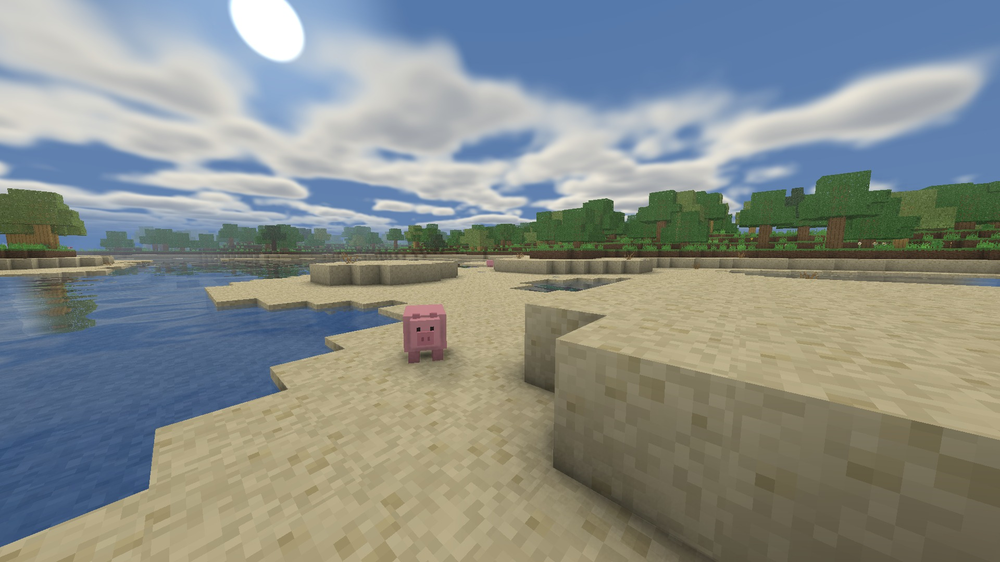

> [!NOTE]
> - This project was built with 99% AI assistance (Claude Opus & Fable) under human oversight. 🤖
> - Expect there to be bugs and balancing issues

# Hollowreach — a vibecoded voxel sandbox

A 3D first-person Minecraft-like, built from scratch in the browser: its **own
WebGL2 voxel engine, procedural world with real biomes, procedural textures
and item models, deferred lighting pipeline, sound engine, mob AI, an in-game
world atlas, and peer-to-peer multiplayer** — all with **zero external
libraries**. Mine, smelt, craft, tier up tools/armour, build, chart the map,
survive the night, and play with a friend over a copy-pasted invite code, all
in **persistent, shareable worlds**.

<table>
<tr>
<td width="50%"> Real-time water reflections mirror the shoreline and sky.</td>
<td width="50%"> Cast shadows dapple the grass beneath a tree.</td>
</tr>
<tr>
<td> Sunlight and god-rays filtering through the canopy.</td>
<td> Moonlight over a quiet bay, with drifting clouds and stars.</td>
</tr>
<tr>
<td> A torch-lit stone cottage, with chests, a bed and glass windows.</td>
<td> A cottage lit against the night, reflected on still water.</td>
</tr>
<tr>
<td> A sheep grazes a coastal meadow.</td>
<td> A pig wanders a sunlit beach beneath volumetric clouds.</td>
</tr>
</table>

## Running it

The easiest way is a [release](https://github.com/Anonymous-Floof/Hollow-Reach/releases):
one zip for every platform — download the latest, unzip, and launch. Running
from a clone of this repo is exactly the same, just from the repo folder.

- **Windows** — double-click **`run.bat`**
- **Linux / macOS** — run **`./run.sh`**

Either one starts a tiny local Python server (ES modules can't load over
`file://`) and opens your browser automatically. That's it — no terminal
navigation, nothing installed, nothing leaves your machine.

Requirements: Python 3 (any recent version — preinstalled on most Linux
distros and on macOS via the developer tools) and a browser with WebGL2
(recent Chrome, Edge, or Firefox). To stop the server, close its window or
press Ctrl+C.

## Controls

| | |
|---|---|
| Move | WASD |
| Look | Mouse |
| Jump / swim up | Space |
| Sprint (1.3×) | Hold Left Ctrl while moving |
| Fly (toggle) | Double-tap Space |
| Sneak (slow) | Left Shift |
| Break block / attack | Left mouse (hold) |
| Place / use station / open door / sleep / **eat** | Right mouse |
| Drop item | Q (one) · Ctrl+Q (whole stack) |
| Climb ladder | Walk into it + W/Space (Shift = down) |
| Select hotbar | 1–9 / scroll |
| Inventory | E |
| Recipe book | R |
| World map (needs an **Atlas**) | M |
| Minimap toggle (needs an **Atlas**) | N |
| Screenshot | F2 |
| Capture menu panorama | F8 |
| Pause | Esc |
| Debug overlay | F3 |

**Settings** (pause or main menu) are grouped into Graphics / Controls / Gameplay
/ Audio tabs — render distance and quality preset, shadow/reflection/cloud/AO
toggles, mouse sensitivity, fall-damage/hunger/monster/flight toggles, and
volume sliders. The in-game **About** screen (main menu) has a quick feature
rundown if you want the highlight reel instead of reading this whole file.

**Screenshots & panorama (F2 / F8):** captures land in an in-game gallery
(Gallery button on the main or pause menu) where you can view them, delete
them, or set one as the main menu's background.

**Bed** — craft from 3 planks + 3 wool (from a sheep), place it (it lays out two cells, pillow
always at the head whichever way you face), then right-click at night to
fast-forward to morning. Sleeping advances the actual game clock, so
time-of-day mechanics (like grass spreading) move forward while you sleep. **Boat** —
craft from 5 planks, right-click to set it on water (or ground); right-click it
to ride (look where you want to go, W/S throttle, A/D strafe), **Shift** to
dismount, and left-click an empty boat to pick it back up.

While you're in a world, browser shortcuts (reload, new/close/switch tab,
bookmark, find, print, save, history, downloads, back/forward, zoom — including
**Ctrl+scroll** page zoom) are swallowed so a stray key can't yank you out or
zoom the page while you sprint-scroll — and closing the tab asks first. Going
fullscreen (F11) lets the game capture even the reserved combos.

**Inventory (Mouse-Tweaks style):** Left-click picks up / places a stack,
right-click takes half / places one. **Shift-click** instantly moves a stack to
the other container (inventory ↔ chest/forge, hotbar ↔ storage). Hold **left**
and drag across slots to split a held stack evenly; hold **right** and drag to
drop one per slot. **Scroll** on a slot to nudge single items across. Hover any
item for its name and stats.

**Biomes:** the overworld is split by temperature and moisture into
**meadows**, dense **forests**, pale **birch groves**, sandy **deserts** and
**snowfields**, with **palm trees** on warm beaches and **papyrus** reeds
growing along shorelines. Mountain ranges rise well above the old hills,
**ravines** crack the surface open, caves widen into proper caverns the deeper
you go, and the deepest passages are **flooded** — bring a way back up.

**Buckets & water:** craft a **bucket** from three iron ingots, right-click
still water to scoop a source, and right-click again to pour it back out
anywhere — the placed water flows for real, so you can move springs, fill
moats, or carve waterfalls. An empty bucket used on a **cow** fills with milk.

**The Atlas:** craft it from **3 paper + 1 leather + 1 azurite** (paper comes
from shoreline **papyrus**) and carry it to unlock cartography. **M** opens a
fullscreen top-down map — every block is one pixel in its true colour, with
relief shading and depth-tinted water — that only charts ground you've
actually explored (the rest stays fogged). Click to drop **waypoints** (rename,
recolour or delete them in the side panel); they show as floating markers in
the world with live distances. Dying pins an automatic **death waypoint** where
you fell (toggle in Settings), and a corner **minimap** (toggle with **N**)
keeps your surroundings and waypoint headings in view. Lose the Atlas — say, by
dying with it — and the map goes with it until you get it back.

**Soul Anchor & Wayshard:** the **Soul Anchor** — one of every ore ringing a
sparkstone — is a placeable block; right-click it to attune your **spawn
point**, and you'll wake there when you die (breaking it unbinds you). The
**Wayshard** (gloamite + sparkstone) is a one-use escape rope: use it deep
underground and it warps you straight up to the surface. Two new deep ores
power them: violet, faintly glowing **Gloamite** and mossy **Verdanite**.

In water you swim: you sink slowly, hold **Space** to rise (and swim into a
shore to climb out), or **Left Shift** to dive. Soft blocks (grass, dirt, wood,
sand) drop when mined by hand — only stone, ores and other hard blocks require
the right tool tier — and a tool only mines faster for the block class it's
*meant* for. Chop all of a tree's logs and its leaves decay on their own.
**Grass creeps**: exposed dirt that's lit and next to grass slowly turns to
grass over in-game days (so a dug-out patch heals over, and beds let you watch it).

**Animals:** wild **sheep**, **pigs** and **cows** wander the grass in
daylight. Left-click to attack (a sword hits hardest, and striking **while
falling lands a critical hit** for 1.5× damage). A sheep drops a block of
**white wool** (which, with planks, crafts a **bed**); a pig drops a **Raw
Porkchop**; a cow drops **Raw Beef** and sometimes **Leather** — cook the meats
in the forge for much better food, and right-click a cow with an empty bucket
to **milk** it. All of them climb hills and steer clear of water, so they stay
on dry land instead of drowning.

**Monsters:** **zombies** rise on solid ground after dark. They need genuine
line of sight to notice you — no seeing through walls — and once they spot you
they path around obstacles to reach you, remembering roughly where you last
were for a few seconds if you break their sight, clawing for damage when they
close in (armour softens the blow). They burn away in direct sunlight, so
they're a night-time threat — hole up or fight back. A slain zombie drops
**rotten flesh** (edible, but a gamble — it might feed you a point or sicken
you for two). Like the animals they climb 1-block ledges and won't wade into
the sea. (Turn them off in Settings.)

**Survival:** a **hunger** bar (next to your hearts) slowly drains as you live and
act — sprinting and swimming burn it faster. Eat to refill it; when it empties you
**starve** and lose health until you eat. You only regenerate health while
well-fed. Hold your breath underwater: a row of **bubbles** counts down once your
head is submerged, and when they run out you start to **drown**. (Hunger can be
toggled off in Settings; breath/drowning is always on.) Taking a hit now also
**wears your armour** — it soaks damage and loses durability for it.

**Atmosphere:** the world breathes a little. A real **sun** and **moon** arc
across the sky (the sun rises in the east), the night fills with a sparse,
twinkling **star field**, **volumetric clouds** drift overhead and cast moving
shadows on the ground, and **dawn rolls in thick fog** that burns off as the
morning brightens. The sun **casts real shadows**, **water reflects** its
surroundings and gives a soft underwater view when you're submerged, and
ambient occlusion + god-rays add depth in caves and under canopies (all
toggleable in Settings if you'd rather have the frame rate back). **Leaves
sway** and the **water surface ripples** with a gentle noisy motion, the camera
does a soft **head-bob** as you walk (more when you sprint) with your held item
swaying along, and mobs — and other players, in multiplayer — walk with real
**limb animation** instead of sliding. All of it is driven on the GPU so it
costs almost nothing.

**Building blocks:** **stairs**, **slabs** and **vertical slabs** can be cut
from *any* wood, sandstone or stone — including the polished and brick
sub-variants — so every material has a matching step and half-block. Stairs and
slabs read where you aim: click a block's top for a bottom slab / right-way-up
stair, its underside (or the upper half of a side) for a **top slab / upside-down
stair**. A slab crafts into a **vertical slab** (and back) for thin walls. Each
**wood type makes its own doors, trapdoors, stairs and slabs**, and any wood's
planks work for sticks, the workbench, chests, beds and boats (even mixed).
Ladders, trapdoors and doors place facing you; doors and trapdoors toggle on
right-click (and politely refuse to close on anyone standing in the frame).
Beyond Stone and Oak there are two more stone families (**Umberstone**,
**Slatestone**, each with polished + brick forms) and four more woods
(**Pine**, **Walnut**, **Birch**, **Palm**) that generate naturally — stone in
underground blobs, the woods as their own trees in their own biomes. **Torches** angle correctly when set on a
wall, and show as a flat sprite in hand and when dropped. **Chests** store 27
stacks; **forges keep smelting with the UI closed** and both keep their contents
until you mine them. Out of Coal? **Smelt logs into Charcoal** — it burns and
crafts torches just like Coal. **Anything wooden burns as forge fuel** — logs,
planks (any wood type), wooden tools, chests, boats, even torches — and the burn
time is read straight from the item's recipe, so it scales with how much wood
went in (no per-item bookkeeping).

**Recipe book (press R):** categorised tabs (Building / Tools / Armour /
Materials / Smelting), a fuzzy **search** box, and grouped cards — near-identical
recipes (every stairs material, every pickaxe tier, a torch's two fuels) collapse
into one card you cycle with the **‹ ›** arrows. Hover any ingredient or result
for the same detailed tooltip the inventory shows (tool tier, mining speed,
durability, armour defense, fuel time).

## The gameplay loop

1. Punch **Oak** trees → logs → **planks** → **sticks** → a **Workbench**.
2. Mine stone with a wood pick for **Cobblestone** → build a **Forge**.
3. Mine ores; smelt **Raw Copper / Iron / Gold** into ingots at the Forge
   (fuel: Coal, logs, planks).
4. Climb tool & armour tiers: Wooden → Stone → Copper → Iron → Gold (fast,
   fragile) → **Diamond**. Each tier unlocks the next ore (e.g. only an Iron+
   pick harvests Diamond).
5. Craft **Torches** to light caves; build with planks, bricks, polished stone,
   sandstone and glass.
6. Gather papyrus and leather for an **Atlas**, mine every ore for a **Soul
   Anchor** to move your spawn, and keep a **Wayshard** in your pocket for the
   trip back up.

Worlds are saved as plain `.json` files in the **`worlds/` folder** next to
`run.bat` (the server reads/writes them over a small `/api/world` endpoint).
This means they're shared no matter which port the server happens to use — unlike
browser storage, which is per-port and used to make worlds seem to vanish. Any
worlds you had in older (localStorage) builds are migrated into `worlds/`
automatically the first time you open the world list. You can still **export a
`.world` file** to share with friends (Pause → Export World; import from the
world-select screen).

## Multiplayer

Two people running the same build can play together with nothing to host or
expose — connections are direct, peer-to-peer WebRTC, set up by pasting a
short invite code (and a reply code) through any chat app you already use.

- **Host:** Pause → Multiplayer → Start Hosting → Create Invite Code, then
  send that code to a friend however you like.
- **Join:** from the main menu, pick **Join a Friend**, paste the invite code,
  and send back the reply code it generates. The host pastes that reply and
  hits Accept.

Connections hole-punch a direct peer-to-peer path via public STUN. Some
strict home routers (symmetric NAT) block every direct path — the standard
fix is a **TURN relay**, and the Multiplayer panel has an optional **Relay
server** section for exactly that: make a free account at a provider like
[metered.ca](https://www.metered.ca/stun-turn) or
[expressturn.com](https://www.expressturn.com) (a web sign-up — nothing to
install), paste the TURN URL + username + credential, and save. Only **one**
side of a connection needs a relay configured, and it only ever carries the
already-encrypted stream. Brief network blips don't drop the session either:
the connection gets a ~12-second grace window to recover before anyone is
declared gone.

The host's world is authoritative — they simulate mobs, water, forges and
time; guests generate the same terrain locally from the shared seed and stay
in sync via live edits and periodic snapshots. Your own movement, mining,
building, crafting and inventory apply instantly on your end regardless of
ping; only seeing *someone else's* edits, combat, and container access wait on
the connection, so play stays responsive even at high latency. Guests can do
everything the host can: place, ride and break **boats** (riding is predicted
client-side, so it feels instant), **milk cows**, use **Wayshards**, land
falling **critical hits**, and attune a **Soul Anchor** — a guest's spawn
point, inventory and position are all saved inside the host's world and
restored if they reconnect. While connected as a guest, the world-list
"Export World" button becomes **Leave World** instead, since it's the host's
save, not yours.

Known limits (for now): both players need to be on the same version of the
game, and a strict-NAT/strict-NAT pairing won't connect until one side
configures a relay (see above).

## Architecture (built to be extended)

Everything is a small ES module under `js/`, grouped by concern:

- `core/` — WebGL context, shaders, matrix math, seeded RNG, input.
- `world/` — `blocks.js` (the master data table), `noise.js`, `worldgen.js`
  (biomes/terrain/caves/ravines/ores/trees — **versioned**, so old worlds keep
  generating exactly as they did when created), `chunk.js`, `mesher.js`, `lighting.js`,
  `shapes.js` (non-cube collision/mesh geometry), `water.js` (the flowing-water
  automaton), `world.js` (chunk streaming + GL buffers), `genpool.js` +
  `genworker.js` (threaded gen).
- `render/` — `texatlas.js` (procedural textures), `sky.js` (day/night +
  clouds), `gbuffer.js` + `renderer.js` (deferred lighting: shadows, SSAO,
  god-rays, water reflections), `entityrenderer.js` (mob/player meshes + walk
  animation), `panorama.js` (menu background skybox).
- `game/` — `player.js`, `physics.js` (shared swept-AABB collision), `raycast.js`,
  `interact.js`, `items.js`, `inventory.js`, `recipes.js`, `crafting.js`,
  `blockentities.js` (chest/forge state), `entities/` (entity framework:
  `registry.js`, `manager.js`, one def per kind — `drop.js`, `boat.js`,
  `sheep.js`, `pig.js`, `cow.js`, `zombie.js` — a shared movement brain in `ai.js`, and an
  `ai/` subfolder — `path.js`, `senses.js`, `fsm.js`, `steering.js`,
  `services.js` — a pathfinding/perception/state-machine backend most mobs
  today only lean on part of).
- `net/` — `protocol.js` (validated message schemas), `signal.js`
  (invite/reply code codec), `transport.js` (WebRTC data channels), `host.js` /
  `client.js` (session logic), `ghosts.js` (remote entity interpolation).
- `audio/` — `engine.js` (Web Audio buses/mixing), `sfx.js`, `ambience.js`,
  `director.js` (hooks sound into gameplay events).
- `ui/` — `menu.js`, `hud.js`, `inventoryui.js`, `recipebook.js`, `settings.js`,
  `notify.js`, `mpui.js` (multiplayer host/join panels + player nameplates),
  `map.js` (the Atlas: world map, waypoints, minimap).
- `save/` — `serialize.js`, `storage.js`, `migrate.js`, `transfer.js`,
  `gallery.js` (screenshot/panorama gallery).

**Entities:** a small, data-driven framework (`game/entities/`) mirroring the
block/item/recipe tables. `world.entities` (an `EntityManager`) owns instances;
each dispatches lifecycle hooks (`update`, `onInteract`, `serialize`) to its
type definition, and shares the player's collision (`game/physics.js`). Player
and entities are both just a `body{pos,hw,h}`. The **item drop** was the first
entity: mined blocks and spilled container contents pop out as drops, vacuumed
into your inventory the moment there's room (so mining feels instant) and only
lingering physically when it's full. The **boat** (`boat.js`) is the first
*rideable*: it floats on water via a buoyancy spring, carries the player in its
seat, steers toward your look direction, and breaks back into an item.
**Sheep, pigs, cows and zombies** use the same `update`/`onInteract`/health hooks the
framework always had room for, plus the shared `ai.js` brain for hill-climbing
and water-avoidance; the zombie additionally uses true line-of-sight and
budgeted A* pathfinding (`entities/ai/senses.js`, `path.js`) instead of
aggroing blindly through walls. In multiplayer, a sixth type, `remote_player`,
mirrors other players as a locally-simulated "ghost" driven by network
snapshots instead of physics. Any entity with a walk cycle — mobs and remote
players alike — animates through a small GPU bone system in
`entityrenderer.js`, driven purely by how its position changes frame to frame,
so it works identically for local mobs and networked ones with zero extra
sync. Entities are saved with the world (ghosts excluded — they're rebuilt
from the network each session).

**Threaded generation:** terrain generation runs on a pool of Web Workers
(`genpool.js` → `genworker.js`), so streaming new or loaded chunks never stalls
the render loop. `worldgen.js` was always a pure function of `(chunk, seed)` with
no DOM/GL — which is exactly what makes it safe to run off-thread. The spawn area
is still generated synchronously so you never fall through on load. Lighting and
meshing remain main-thread but are count-budgeted per frame; the same pool
pattern is the intended home for future threaded lighting / mob AI.

### Common extension points

- **New block:** add one entry to `js/world/blocks.js` and a matching painter in
  `js/render/texatlas.js`. Saves stay valid because blocks are stored by stable
  string key, not numeric id.
- **New recipe:** add a row to `js/game/recipes.js`. It appears in the in-game
  Recipe Book (press **R**) automatically — the browser is generated from the data.
- **New entity** (mob, boat, projectile…): add a definition to
  `js/game/entities/` and register it in `registry.js` — give it a `size`, set
  `physics`, and implement the hooks you need (`update`, `onInteract`, …). For
  perception or pathing, reach for `entities/ai/` (`senses.js`, `path.js`)
  rather than rolling your own.
- **New setting:** add a row to `SCHEMA` in `js/ui/settings.js` — the UI and
  persistence pick it up automatically.
- **Save format change:** bump `SAVE_VERSION` in `js/save/serialize.js` and add a
  migration function in `js/save/migrate.js` (`vN → vN+1`).
- **Shipping a release:** the public version lives in `js/version.js`; changes
  are outlined in `CHANGELOG.md` and `tools/release.py` bumps, packages, and
  publishes the GitHub release — the whole flow is three commands, see
  [docs/RELEASING.md](docs/RELEASING.md).

## Deliberately deferred (foundation already in place)

More mob types & deeper combat variety (sheep, pigs, cows and zombies are in,
and the zombie already has real line-of-sight and pathfinding), farming/crops
(hunger, eating, milk and cooking are in — planting and growing isn't),
Web-Worker *meshing* specifically (generation is already threaded; lighting
and meshing are still main-thread, just frame-budgeted), greedy meshing, fully
smooth (non-voxel) global lighting, and future uses for the newest ores —
**Gloamite** is earmarked for more teleport/void tech beyond the Wayshard, and
**Verdanite** for growth and alchemy once farming lands.

The health + fall-damage system is wired in (toggle in Settings) as the seed for a
future full survival mode — armour defense already feeds it.
